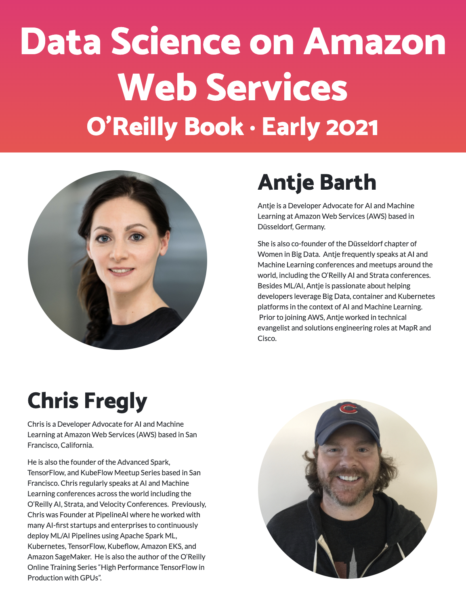

## Monthly KubeFlow Workshop
You must register on [**Eventbrite**](https://www.eventbrite.com/e/full-day-workshop-kubeflow-gpu-kerastensorflow-20-tf-extended-tfx-kubernetes-pytorch-xgboost-tickets-63362929227).  

_All instructions will come through Eventbrite.  Please make sure your Eventbrite email address is up to date._

# Upcoming O'Reilly Book:  _Data Science on Amazon Web Services_
Register for early access directly on our [**website**](https://datascienceonaws.com).

_Influence the book by filling out our [**quick survey**](https://www.surveymonkey.com/r/798CMZ3)._

## Community Events
* [PipelineAI Monthly Webinar (TensorFlow + Spark + GPUs + TPUs)](https://www.eventbrite.com/e/webinar-pipelineai-kubeflow-tensorflow-extended-tfx-airflow-gpu-tpu-spark-ml-tensorflow-ai-tickets-45852865154)
* [Advanced Kubeflow AI Meetup (Global)](https://www.meetup.com/Advanced-KubeFlow/)
* [Data Science on Amazon Web Services](https://datascienceonaws.com)

## Support
* Email:  [help@pipeline.ai](mailto:help@pipeline.ai)
* Web:  https://support.pipeline.ai
* YouTube:  https://youtube.pipeline.ai
* Slideshare:  https://slideshare.pipeline.ai
* Workshop:  https://workshop.pipeline.ai
