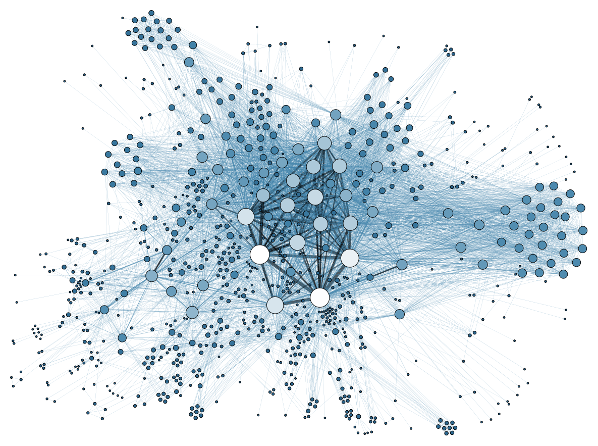

# Tribe
**Tribe extracts a network from an email mbox and writes it to a graphml file for visualization and analysis.**

[![PyPI version][pypi_img]][pypi_href]
[![Build Status][travis_img]][travis_href]
[![Coverage Status][coveralls_img]][coveralls_href]
[![Code Health][health_img]][health_href]
[![Documentation Status][rtfd_img]][rtfd_href]
[![Stories in Ready][waffle_img]][waffle_href]

Tribe is a utility that will allow you to extract a network (a graph) from a communication network that we all use often - our email. Tribe is designed to read an email mbox (a native format for email in Python)and write the resulting graph to a GraphML file on disk. This utility is generally used for District Data Labs' Graph Analytics with Python and NetworkX course, but can be used for anyone interested in studying networks.

## Downloading your Data

One easy place to obtain a communications network to perform graph analyses is your email. Tribe extracts the relationships between unique email addresses by exploring who is connected by participating in the same email address. In particular, we will use a common format for email storage called `mbox`. If you have Apple Mail, Thunderbird, or Microsoft Outlook, you should be able to export your mbox. If you have [Gmail](https://gmail.com) you may have to use an online email extraction tool. For more on downloading your data, see [Exporting an MBox from Email](http://ddl-tribe.readthedocs.org/en/latest/emails/)

## Extracting a Graph from Email

1. Download your email mbox, in this example it's in a file called `myemails.mbox`.

2. Install the tribe utility with `pip`:

        $ pip install tribe

    Note that you may need administrator priviledges to do this.

3. Extract a graph from your email MBox as follows:

        $ tribe-admin.py extract -w myemails.grpahml myemails.mbox

    Be patient, this could take some time, on my Macbook Pro it took 12 minutes to perform the complete extraction on an MBox that was 7.5 GB.

You're now ready to get started analyzing your email network!

## Developing for Tribe

To work with this code, you'll need to do a few things to set up your environment, follow these steps to put together a _development ready environment_. Note that there are some variations of the methodology for various operating systems, the notes below assume Linux/Unix (including Mac OS X).

1. Fork, then clone this repository

    Using the git command line tool, this is a pretty simple step:

        $ git clone https://github.com/DistrictDataLabs/tribe.git

2. Change directories (cd) into the project directory

        $ cd tribe

3. (Optional, Recommended) Create a virtual environment for the code and dependencies

    Using `virtualenv` by itself:

        $ virtualenv venv
        $ source venv/bin/activate

    Using `virtualenvwrapper` (configured correctly):

        $ mkvirtualenv -a $(pwd) tribe

4. Install the required third party packages using `pip`:

        (venv)$ pip install -r requirements.txt

5. Test everything is working:

        $ python tribe-admin.py --help

    You should see a help screen printed out.

### Contributing

Tribe is open source, and we'd love your help. If you would like to contribute, you can do so in the following ways:

1. Add issues or bugs to the bug tracker: [https://github.com/DistrictDataLabs/tribe/issues](https://github.com/DistrictDataLabs/tribe/issues)
2. Work on a card on the dev board: [https://waffle.io/DistrictDataLabs/tribe](https://waffle.io/DistrictDataLabs/tribe)
3. Create a pull request in Github: [https://github.com/DistrictDataLabs/tribe/pulls](https://github.com/DistrictDataLabs/tribe/pulls)

Note that labels in the Github issues are defined in the blog post: [How we use labels on GitHub Issues at Mediocre Laboratories](https://mediocre.com/forum/topics/how-we-use-labels-on-github-issues-at-mediocre-laboratories).

If you are a member of the District Data Labs Faculty group, you have direct access to the repository, which is set up in a typical production/release/development cycle as described in _[A Successful Git Branching Model](http://nvie.com/posts/a-successful-git-branching-model/)_. A typical workflow is as follows:

1. Select a card from the [dev board](https://waffle.io/DistrictDataLabs/tribe) - preferably one that is "ready" then move it to "in-progress".

2. Create a branch off of develop called "feature-[feature name]", work and commit into that branch.

        ~$ git checkout -b feature-myfeature develop

3. Once you are done working (and everything is tested) merge your feature into develop.

        ~$ git checkout develop
        ~$ git merge --no-ff feature-myfeature
        ~$ git branch -d feature-myfeature
        ~$ git push origin develop

4. Repeat. Releases will be routinely pushed into master via release branches, then deployed to the server.

## Contributors

Thank you for all your help contributing to make Tribe a great project!

### Maintainers

- Benjamin Bengfort: [@bbengfort](https://github.com/bbengfort/)

### Contributors

- Your name welcome here!

## Changelog

The release versions that are sent to the Python package index (PyPI) are also tagged in Github. You can see the tags through the Github web application and download the tarball of the version you'd like.

The versioning uses a three part version system, "a.b.c" - "a" represents a major release that may not be backwards compatible. "b" is incremented on minor releases that may contain extra features, but are backwards compatible. "c" releases are bug fixes or other micro changes that developers should feel free to immediately update to.

### Version 1.1.2

* **tag**: [v1.1.2](https://github.com/DistrictDataLabs/tribe/releases/tag/v1.1.2)
* **release**:  Thursday, November 20, 2014
* **deployment**: Friday, March 11, 2016
* **commit**: [69fe3c6](https://github.com/DistrictDataLabs/tribe/commit/69fe3c69130899479be2e33f73872d6cfedd4659)

This is the initial release of Tribe that has been used for teaching since the first SNA workshop in 2014. This version was cleaned up a bit, with extra dependency removal and better organization. This is also the first version that was deployed to PyPI.

<!-- References -->
[pypi_img]: https://badge.fury.io/py/tribe.svg
[pypi_href]: https://badge.fury.io/py/tribe
[travis_img]: https://travis-ci.org/DistrictDataLabs/tribe.svg?branch=master
[travis_href]: https://travis-ci.org/DistrictDataLabs/tribe/
[coveralls_img]: https://coveralls.io/repos/github/DistrictDataLabs/tribe/badge.svg?branch=master
[coveralls_href]: https://coveralls.io/github/DistrictDataLabs/tribe?branch=master
[health_img]: https://landscape.io/github/DistrictDataLabs/tribe/master/landscape.svg?style=flat
[health_href]: https://landscape.io/github/DistrictDataLabs/tribe/master
[waffle_img]: https://badge.waffle.io/DistrictDataLabs/tribe.png?label=ready&title=Ready
[waffle_href]: https://waffle.io/DistrictDataLabs/tribe
[rtfd_img]: http://readthedocs.org/projects/ddl-tribe/badge/?version=latest
[rtfd_href]: http://ddl-tribe.readthedocs.org/en/latest/
